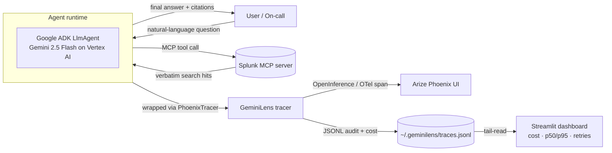

# Architecture



## What lands in a trace

| field | source |
|---|---|
| `model.name` | the Gemini SKU dispatched (e.g. `gemini-2.5-flash`) |
| `llm.token_count.prompt` | `usage_metadata.prompt_token_count` |
| `llm.token_count.completion` | `usage_metadata.candidates_token_count` |
| `llm.usage.cached_tokens` | `usage_metadata.cached_content_token_count` |
| `llm.cost.usd` | computed from the 2026 Gemini price table (cache-aware) |
| `llm.latency.ms` | `perf_counter` delta around the SDK call |
| `llm.retry_count` | incremented per retry inside the wrapper |
| `tool.name` | each Splunk MCP tool invoked (e.g. `search`, `list_savedsearches`) |
| `tool.redacted_args_hash` | sha256 of args with PII stripped, for compliance |

## Splunk Agentic Ops integration

The Splunk MCP server (or any other Splunk-AI surface) gets wrapped by `PhoenixTracer.call(...)`. Each MCP tool call becomes a child span under the agent's run, so a single user question produces one CHAIN span with a tree of LLM + TOOL spans you can drill into in Phoenix.

## Repository layout

```
src/geminilens/
  observer.py    # PhoenixTracer + GeminiObserver
  tracer.py      # OpenInference span shape + cost table
  cost.py        # Gemini 2026 cache-aware pricing
  drift.py       # latency / cost / output drift detectors
  exporters/     # Arize Phoenix, Splunk HEC, MongoDB Atlas, ...
  guard.py       # egress allowlist for tool HTTP calls
  agent.py       # reference research agent (ADK)
app/dashboard.py # Streamlit live-trace UI
```
